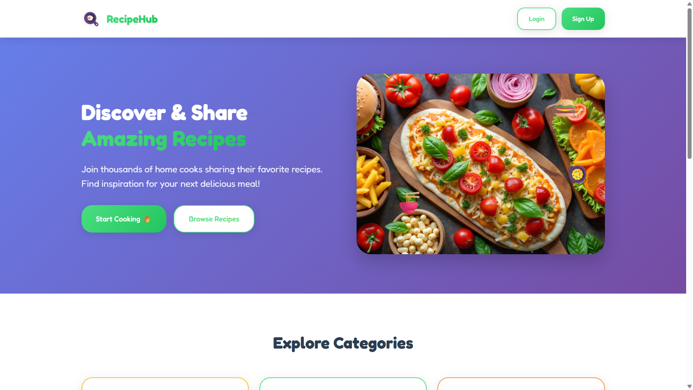

📋 RecipeHub – Your Personal Recipe Sharing App
RecipeHub is a full-stack web application that allows users to share, browse, edit, and manage recipes. Built using Node.js, Express, MySQL, and HTML/CSS/JS, it’s perfect for food lovers who want to create and explore a diverse collection of recipes.
---

---
🚀 Features

✅ User Registration & Login (with password hashing)

🍳 Add your own recipes with images

📂 Explore popular recipe categories

✏️ Edit and delete your recipes

📸 Upload recipe images (stored locally)

📱 Responsive UI design

📊 Community recipe dashboard

---

🛠️ Tech Stack

Frontend: HTML, CSS (custom styled), JavaScript

Backend: Node.js, Express.js

Database: MySQL

Image Uploads: Multer (saved to /uploads/)

Password Security: bcrypt

---

📁 Folder Structure

```bash
RecipeHub/
├── backend/
│   ├── server.js
│   └── uploads/           # image files uploaded via Multer
├── frontend/
│   ├── index.html
│   ├── login.html
│   ├── signup.html
│   ├── dashboard.html
│   ├── add-recipe.html
│   ├── edit-recipe.html
│   ├── category.html
│   ├── script.js
│   └── style.css
├── README.md
├── package.json
```

---

🔐 MySQL Configuration

Ensure your MySQL credentials are configured correctly inside backend/server.js:


const db = mysql.createConnection({
  host: 'localhost',
  user: 'root',
  password: '03062001@Raju',
  database: 'recipehub'
});

✅ You must create a database in MySQL Workbench:

CREATE DATABASE recipehub;

Then, use the provided SQL to create the users and recipes tables.

---

📦 Installation & Setup

1. Clone the repository:

git clone https://github.com/YOUR_USERNAME/recipehub.git

2. Install backend dependencies:

cd recipehub/backend
npm install

3. Start the server:

node server.js


4. Open your frontend files directly in the browser (e.g. dashboard.html) or use Live Server in VS Code.

---

🎯 Usage

Register a user account from the signup page

Login with your credentials

Add new recipes with dynamic ingredients & steps

View, update, or delete your recipes from the dashboard

Browse recipes by category from the homepage

---


✅ Test Cases

🔐 User Authentication

TC1: Signup with valid credentials → User created

TC2: Signup with existing email → Error message

TC3: Login with valid credentials → Dashboard access

TC4: Login with wrong credentials → Error shown

TC5: Access dashboard without login → Should restrict access

TC6: Logout → Session ends, redirect to login


🍽️ Recipe Management

TC1: Add recipe with title, description, image → Displays in dashboard

TC2: Add ingredients/steps dynamically → All values stored in database

TC3: Edit recipe → Changes reflected immediately

TC4: Delete recipe → Removed from dashboard and DB

TC5: Upload recipe without image → Still allowed (optional)

---

📂 Category & Community

TC1: Click category on homepage → Recipes filtered properly

TC2: Recipes show with images and metadata → All loaded dynamically

TC3: If no recipe exists for a category → Message displayed

---

🧪 Sample Data

Here’s an example of a valid recipe input:

```json
{
  "title": "Paneer Butter Masala",
  "category": "Dinner",
  "prepTime": "30 minutes",
  "servings": "2",
  "description": "Delicious North Indian curry with paneer.",
  "ingredients": ["Paneer", "Tomato", "Butter", "Spices"],
  "instructions": ["Heat butter", "Add tomatoes", "Add paneer", "Cook"]
}
```

---

🖥️ Screenshots (To be added manually on GitHub)

Add relevant screenshots of:

Signup page

Add recipe form

Dashboard with recipes

Category-wise view

---

🧠 Reflection (For Report)

Developed in multiple iterations with debugging and UI testing.

Adapted from original conception idea: added image upload and edit/delete options.

Used MySQL over MongoDB due to familiarity and structured schema.

Faced difficulty with dynamic fields but solved via script.js.

Backend errors debugged using terminal logs and trial-and-error testing.
